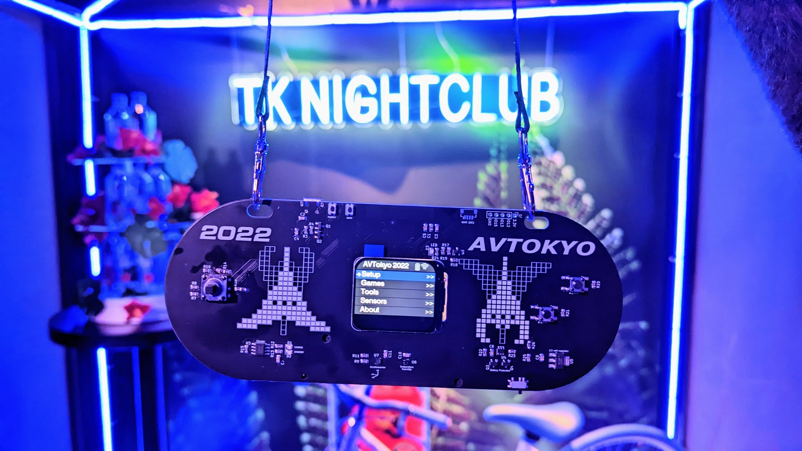
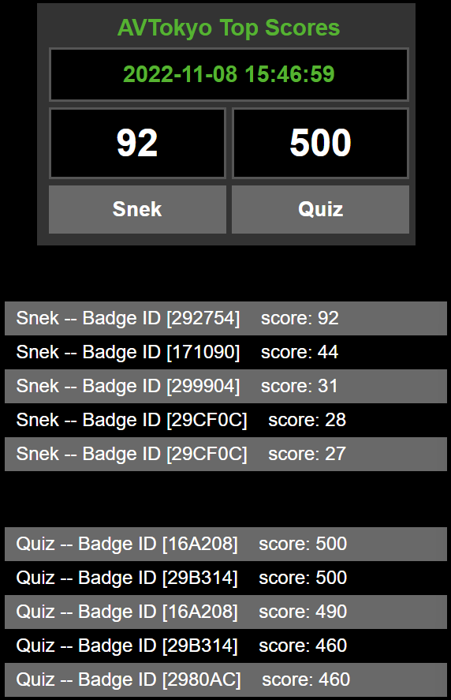
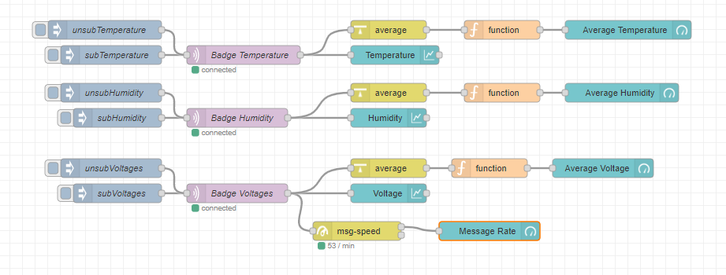
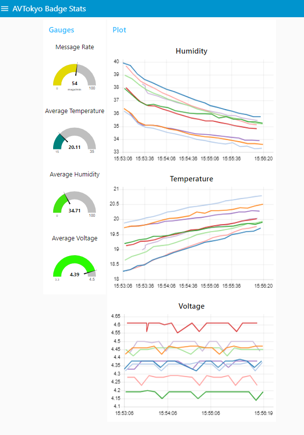
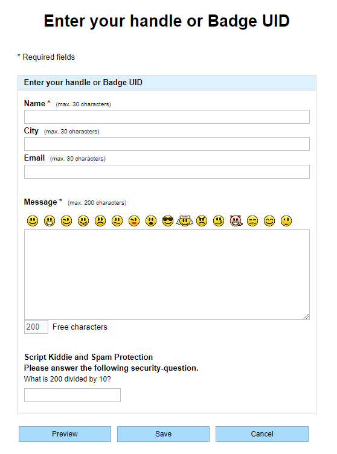
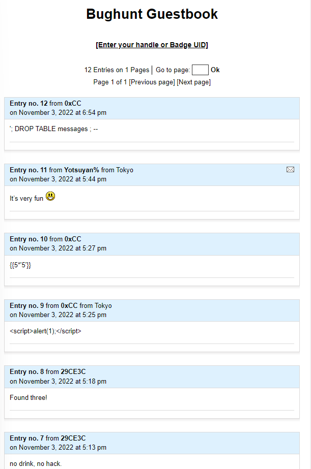

## AVTokyo 2022 event badge

### MQTT enabled, Hacker tools, Sensors and Games on ESP32
The AVTokyo 2022 event attendee badge was designed and produced by VPCAsia. Our vision was to provide a useful tool for the attendee not only at the event, but far into the future.

It is based on an 8MB ESP32 with 280x240 pixel TFT full color display (sourced from smart watches). Additionally, it includes a joystick (4 directions plus “press to select”), two game buttons (B and A), and two sensors (Temperature/Humidity and Accelerometer). Finally, the device is fully battery powered, relying on an 18650 style Li-ion battery with associated protections and USB charging.

The software runs a variety of open source Arduino libraries. In particular, we utilized [tcMenu](https://www.thecoderscorner.com/products/arduino-libraries/tc-menu/) and TFT_eSPI to provide all of our software UI, and Adafruit libraries to manage sensors and MQTT (Message Queue, Telemetry Transport).

While WiFi is connected and MQTT messaging is enabled, the badge will send Temperature, Humidity and Battery Voltage measurements to an MQTT server every 5 seconds (the interval is redefinable). Additionally, when you obtain a new best personal score on any game, the new score will be queued to be sent in the next MQTT post. While gaming, MQTT posting is temporarily disabled, in order to provide the best gaming experience.

## Tour of the Board
Most of the badge components are self-explanatory, but I will attempt to highlight the main components and features. The circuitry between the joystick and screen is responsible for charging the battery (on the back). This is fed from the USB connector, and will charge the battery even when the badge is switched off. There are two LEDs, Standby and Charge. Once fully charged, the Charge LED will turn off and the Standby LED will light. These are rather bright! I started placing tape over my test units to dampend the brightness. ;)

Directly below the screen are the two sensors. On the left, we have an SHTC3 temperature and humidity sensor. On the right we have the KXTJ3-1057 accelerometer. Its not a particularly expensive device, so don't expect much. It's good enough for basic movement and orientation measurement. In the future, I hope to write some better drivers and filters for it to make the data more usable. At which point, I'll try to make a game using tilt/movement.

Above the power switch (bottom right) we have the battery protection circuits and voltage regulator which powers the board. The protection cirucit is a very basic back to back mosfet configuration. The control IC *Should* cut power when the battery voltage gets below 3.2, but in my testing this turned out not to be the case. So, until I perform further tests, please dont trust this circuit to protect your battery from long term discharge. Remove the battery for storage.

Speaking of that power switch....   :(     Yes, NOW we know it's terrible. Attendee @mimura1133 found some alternate part numbers from Digikey if you have the skills to replace the switch. EG1215AA and CUS-12TB should fit. The part used on the badge is from G-Switch, MK-12C02-GXXX. We have yet to determine if this was a case of bad quality switches, or something in the reflow oven process made some of the switch plastics brittle. While this issue seemed considerable at the time of the event, we only had 42 total switch failures (of 400). The cracked resistor on the joystick was actually a higher failure rate.

Above the screen on the left we have the USB connector and associated ESP32 programming circuitry. This consists mainly of a USB to UART interface chip (CH340) and the Enable / Boot config buttons. Under normal circumstances using USB to program the badge, you should not need to bother with the buttons. If you get into a jam though, its nice to be able to manually trigger them. Additionally, the left button (enable) can be used as a reset button, so you dont have to toggle the power switch.
The USB connector can not only be used for programming but provides serial output from the ESP32 as well. There are some diagnostic messages as the badge goes through various tasks. The WiFi and Bluetooth scanners also output a lot of additional data here which cant possibly fit on the screen.

At the screen's top right corner we have a user LED and backlight control circuitry. You may have discovered the the screen backlight is dimmable. This is the circuitry making that possible. The LED can be used for your own applications as well. We only use it to indicate the completion of the boot process (sort of a debugging tool for us).

Above the right side of the screen on the edge of the PCB we included some features for your own projects and future expansion. First, there is an I2C "Quiic" footprint. You will need to obtain and solder this yourself (was impossible at the time of production due to supply chain issues). This is a JST BM04B-SRSS connector or equivalent. 
To the right of the Quiic connector is a 5 pin header (2.54 mm pitch). This has ground, 3.3 volts, and three free GPIO from the ESP32. We are excited to see what you all come up with for these connections.

The back of the badge is dominated by the large 18650 lithium-ion battery holder at the bottom. Right in the middle is the ribbon cable for the screen. At top center we have the ESP32 module itself. This is an ESP32-Wroom-32 8MB part. Yes, it really IS 8MB. The firmware as flashed on the day of the event has a 4MB partition configuration. However, if you build fresh from this repository, it will build an 8Mb partition. All of our code now occupies only 20%! Lots of room left for more games, tools and custom apps. In the near future we will make some tutorials on how to add your project to the badge menu.

## Fixes to the production version
The PCB production and most of the component mounting was completed by JLCPCB. However, we still had some work to do. We glued the displays to the PCB and soldering the ribbon cable to the backside ourselves. Additionally, we mounted the battery case. However, you may notice some.. urr.. "Corrections" to some parts around the joystick. Unfortunately, I (Emery) made a mistake on the fill pattern, in which two pull-up resistors did not get connected to 3.3 Volts. So, we had to scrape away some of the solder mask and solder zero ohm jumpers to connect these resistors to the 3.3 volt fill. This added a LOT of additional work. The kicad files have been corrected. So if you attempt to produce the board yourself, don't worry.

We did experience a very unusual issue during production. Thankfully, I had created this code before the final code was complete, so that we could test all functions before performing final firmware flashing. This test code included the Button Test (in the tools menu) as well as the Sensors page to confirm sensors were working.
The issue we found is that Many (like, 1 of every 8 or 10) badges would indicate Left on the joystick, permanently. It took some time to identify the issue: The associated pull-up resistor (R8, on the left side of the joystick), was cracked. The crack is nearly impossible to see, even with a good magnifying lense. However, when we attempted to desolder it, it came off in two pieces! We were able to replace this resistor and managed to save 58 badges.

## About the Server
On our server side, we used a variety of services. It all starts by receiving the MQTT message in the MQTT server. From here, messages are written to a database using some custom Java.
From this database we then made web pages to output various statistics. In particular, we wanted to make a scoreboard for the two games included with the badge.

MQTT is simply a message bucket service. Many other services can subscribe to it. In fact, the code which writes to the database simply subscribes to the MQTT messages. Because this concept is so flexible, other services can easily subscribe at the same time.

Node-Red is a very user friendly GUI based data application builder. It was a simple matter to create a Node-Red flow to subscribe to badge topics using wild cards, allowing us to easily gather temperature measurements from ALL badges at once for example. This same flow outputs a web page with gauges, plots and text data. Node-Red performance is not very quick, but because it is only subscribing to topics (and another service handles database work), it has no impact on MQTT or our database.

### WiFi BugHunt
WE had one more game to play at the event: a WiFi BugHunt! These consisted of an ESP32 with battery pack hidden inside the nightclub (see AVTokyo_2022_Badge/Software/AVT_FindMe_Switcher/). Using the WiFi scanner tool in the badge (or your smartphone), players could seek out the three hidden WiFi access points. Once found, there was a QR code printed on the container of the WiFi AP. Scanning the code with your smartphone would bring you to a guest book web page, where you could sign that you found the AP and leave a comment. To make it more challenging, the APs occasionally dropped AP mode and joined local WiFi to send us an MQTT message containing the battery voltage, so we could monitor the devices in real time. It was quite entertaining to see all the script attacks people tried on our guestbook page ;)

## Getting the code up and running
The source code is "almost ready to run". You will need to install an editor such as Visual Studio Code. Within VSCode, add the PlatformIO extension. After opening the sourcecode folder, PlatformIO SHOULD download all the required extensions (mainly the Arduino framework and the ESP32 platform). All the required libraries are already included in the source code folder (.pio/libdeps/esp32dev/).
Depending on your initial VSCode and PlatformIO configuration, you MAY need to add "lorol/LittleFS_esp32@^1.0.6" to the platform.ini file, under the "lib_deps = " heading. If during compile you receive errors concerning LittleFS, either add it to the platform.ini file, or remove it (just add ; to the beginning of the line).

Additionally, you will need to create a "secrets.h" file like so:

//wifi
#define SECRET_SSID "your first AP"
#define SECRET_PASS "AP1 password"

#define SECRET_SSID2 "Second AP"
#define SECRET_PASS2 "AP2 password"

#define SECRET_SSID3 "third AP"
#define SECRET_PASS3 "AP3 password"

//mqtt
#define SECRET_SERVER "MQTT URL or IP" 

You can add as many WiFi access points as you want. Look at the MyWiFi.cpp file to add them to the array. The badge will first try to connect to whatever AP you have saved manually from the menu system. If that connection fails, it will then scan through the list given at the top of MyWiFi.cpp (the list is filled in from the secrets.h file). It will try to match any of these AP names to a scanned list available. If one matches, it will try to connect.

In addition to WiFi, you may want to point the badge to your own MQTT server. You may enter it manually in the menu, but you may prefer to hard code it. We have only defined the SECRET_SERVER keyword in the secrets.h file. This assumes an unsecured connection. So, you may want to modify MQTT_Sensors.cpp and secrets.h such that you can define a username and access key in secrets.h.
